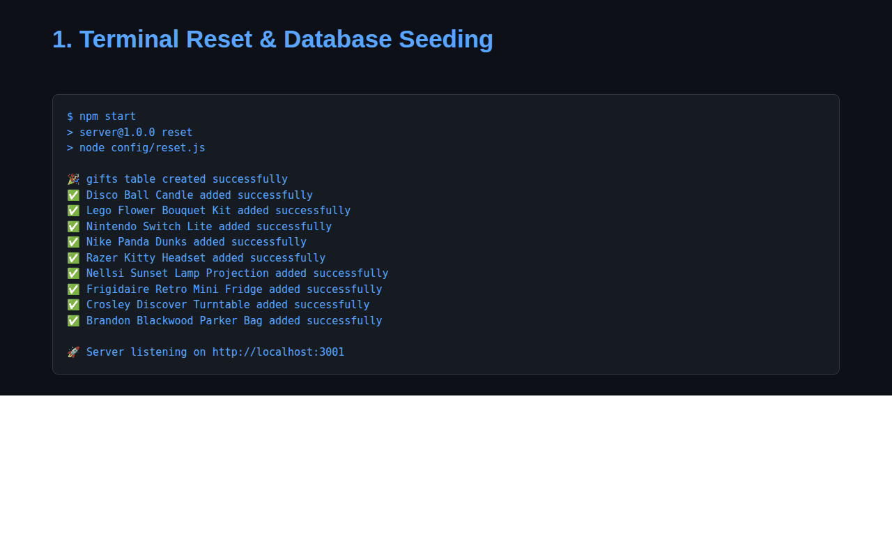

# UnEarthed Part 2 - Database Integration & Architecture Tracing

## Overview

UnEarthed Part 2 transitions the Express application from static arrays to a cloud PostgreSQL database hosted on Render. The application features connection pooling, automated database table creation and seeding, an MVC controller structure, Pico CSS frontend styling, and full end-to-end call stack architectural tracing.

---

## Architecture & Call Stack Tracing

Full call stack traces and architectural domain boundaries are documented in **[ARCHITECTURE.md](./ARCHITECTURE.md)**.

---

## Key Features

- **Cloud PostgreSQL Integration**: Configured with `pg.Pool` connection pooling in `server/config/database.js` using SSL configurations (`rejectUnauthorized: false`).
- **Secure Environment Management**: Managed via `.env` loaded with `dotenv` and ignored in `.gitignore`.
- **Automated Reset & Seeding**: Running `npm run reset` or `npm start` drops the `gifts` table, provisions the schema with strict data constraints (`id SERIAL PRIMARY KEY`, `name`, `"pricePoint"`, `audience`, `image`, `description`, `"submittedBy"`, `"submittedOn"`), and automatically seeds default items.
- **MVC Architecture**: `server/controllers/gifts.js` contains an asynchronous `getGifts` handler querying `SELECT * FROM gifts ORDER BY id ASC`, returning HTTP `200 OK` JSON rows or HTTP `409 Conflict` error statuses.
- **Pico CSS Integration**: Styled with [Pico CSS](https://picocss.com/) for clean, semantic, and responsive frontend design.

---

## Setup & Running

### 1. Backend Setup

```bash
cd server
npm install
npm run reset   # Reset and seed PostgreSQL database
npm start       # Auto-resets DB and starts Express server via Nodemon
```

### 2. Frontend Setup

```bash
cd client
npm install
npm run dev     # Run Vite dev server
```

---

## Demo / Walkthrough



---

*Last Updated: February 2025*
